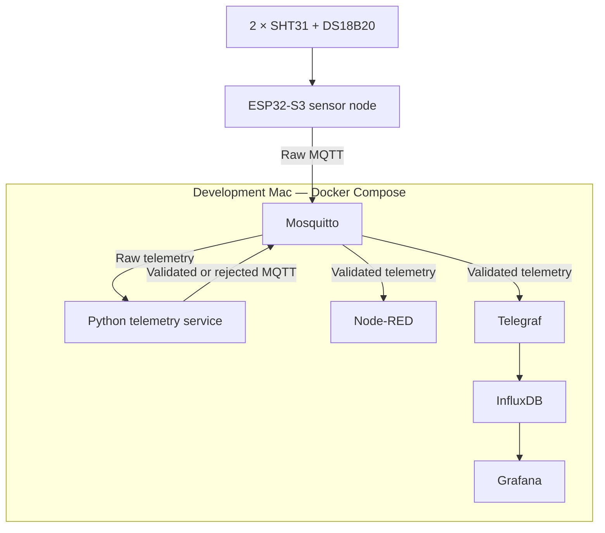

# System Architecture

## Current status

The containerized backend and dashboard pipeline are implemented and verified on the development Mac using simulated ESP32-S3 telemetry.

Physical sensor integration and production ESP32-S3 firmware are still pending. Raspberry Pi hosting is deferred because the Pi Zero 2W does not have enough memory for the complete development stack.

## System boundary

MicroHydros collects environmental measurements from an ESP32-S3, validates each reading independently, stores validated telemetry and presents historical measurements through a dashboard.

Exact MQTT topics, payload fields, units and rejection formats are defined in the [data contract](data-contract.md).

## Components

| Component | Responsibility | Current state |
| --------- | -------------- | ------------- |
| Internal SHT31 | Measure internal air temperature and relative humidity | Hardware received; integration pending |
| External SHT31 | Measure external air temperature | Hardware received; integration pending |
| Waterproof DS18B20 | Measure water or nutrient-solution temperature | Hardware received; integration pending |
| ESP32-S3 | Read sensors and publish raw MQTT telemetry over Wi-Fi | Hardware received; firmware integration pending |
| Mosquitto | Route authenticated MQTT messages | Implemented |
| Python telemetry service | Validate, timestamp and separate measurements | Implemented and tested |
| Node-RED | Display validated MQTT messages and support future automation | Implemented for visual inspection |
| Telegraf | Convert validated MQTT messages into InfluxDB writes | Implemented |
| InfluxDB | Store validated time-series measurements | Implemented |
| Grafana | Query InfluxDB and display provisioned dashboards | Implemented |

## Current deployment

All six software services run as Docker containers on the development Mac.

The ESP32-S3 must use the Mac’s local network address when connecting to Mosquitto. `localhost` only refers to the device on which a client is running.

Raspberry Pi deployment is retained as an optional future target. See [Raspberry Pi deployment](raspberry-pi-deployment.md).

## Measurement flow

1. The ESP32-S3 reads the physical sensors.
2. It records each reading and sensor status in one raw message.
3. It publishes the raw message to Mosquitto using MQTT QoS 1.
4. The Python service receives the message and assigns one UTC timestamp.
5. Common metadata is validated.
6. Each sensor measurement is validated independently.
7. Valid measurements are published individually to validated topics.
8. Invalid messages or measurements are published to the rejected topic.
9. Node-RED receives validated measurements for visual inspection.
10. Telegraf reads validated measurements and writes them to InfluxDB.
11. Grafana queries InfluxDB and displays the four telemetry panels.

A failed sensor measurement does not prevent other valid measurements from the same raw message from continuing through the pipeline.

## Validation responsibility

The ESP32-S3 performs basic hardware-level checks:

- Whether a sensor was detected
- Whether a sensor read succeeded
- Whether the returned value can be represented safely

The Python telemetry service is the validation and timestamp authority. It checks:

- JSON structure
- Contract version
- Device identity
- Required metadata
- Sensor status
- Value type
- Finite numeric values
- Technical plausibility ranges

Validation determines whether data is technically trustworthy. Alarm thresholds represent desired growing conditions and are a separate concern.

## Runtime characteristics

| Property | Current decision |
| -------- | ---------------- |
| MQTT QoS | `1` |
| Retained telemetry | No |
| Timestamp authority | Python telemetry service |
| Timestamp format | UTC ISO 8601 |
| Telemetry-service state | Stateless |
| Historical storage | InfluxDB |
| Dashboard | Grafana |
| Offline buffering | Not implemented |
| Sequence-gap detection | Not implemented |
| Automatic silent-hang recovery | Not implemented |

MQTT QoS 1 may deliver duplicates. The combination of `device_id`, `boot_id` and `sequence` identifies the original measurement cycle, but duplicate removal and sequence-gap detection are not currently implemented.

## Persistence

Docker named volumes preserve:

- Mosquitto data
- Node-RED data
- InfluxDB data and configuration
- Grafana data

Grafana’s datasource and MicroHydros dashboard are also provisioned from version-controlled files so they can be recreated without relying only on the Grafana volume.

## Observability

The Python telemetry service logs:

- MQTT connection and subscription state
- Raw-message receipt
- Device ID, topic and payload size
- Validated and rejected measurement counts
- MQTT topics queued for publishing
- Publishing failures

These logs close the earlier successful-processing visibility gap. They do not yet detect a process that remains alive but stops processing callbacks.

## Security boundary

The current deployment is intended for a trusted local development network.

Implemented:

- MQTT username/password authentication
- Local secret files excluded from Git

Not yet implemented:

- TLS
- MQTT topic ACLs
- Separate least-privilege InfluxDB tokens
- Node-RED editor authentication

The development services must not be exposed directly to the internet.
