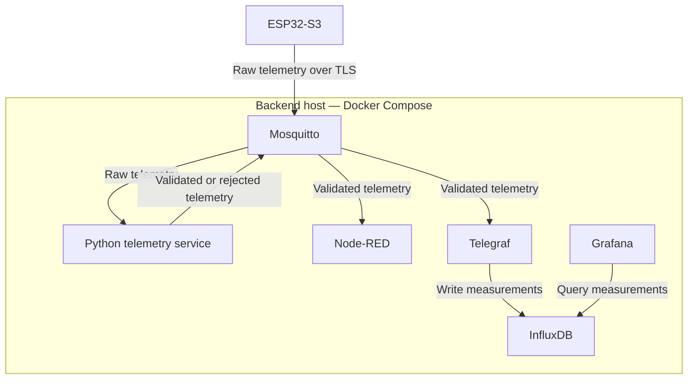

# System architecture

MicroHydros collects environmental telemetry from an ESP32-S3, validates individual measurements, stores accepted readings and displays them through dashboards.

See the [data contract](data-contract.md) for payloads, topics and validation rules, and the [Docker README](../docker/README.md) for backend configuration.

## Current status

The backend runs in Docker on a development host. The ESP32-S3 has published synthetic telemetry over Wi-Fi and MQTT TLS, with validated readings confirmed in Node-RED and InfluxDB.

Connectivity has been verified across two Wi-Fi networks using a stable mDNS hostname.

Physical sensor integration and periodic publishing remain pending. The current firmware publishes one synthetic payload per boot.

## Components

| Component | Responsibility |
| --------- | -------------- |
| ESP32-S3 | Connect to Wi-Fi and publish raw telemetry |
| Mosquitto | Route MQTT messages with TLS, authentication and topic ACLs |
| Python telemetry service | Validate measurements, assign timestamps and publish results |
| Node-RED | Display validated messages for inspection |
| Telegraf | Convert validated MQTT telemetry into InfluxDB writes |
| InfluxDB | Store time-series measurements |
| Grafana | Query and visualize stored measurements |

The planned physical sensors are:

| Sensor | Measurement |
| ------ | ----------- |
| Internal SHT31 | Air temperature and relative humidity |
| External DS18B20 | External air temperature |
| Waterproof DS18B20 | Water temperature |

## Data flow



The telemetry service validates common metadata before checking measurements individually. One rejected measurement does not block other valid measurements from the same payload.

The current synthetic payload produces three accepted measurements and one external-temperature rejection. The cause of that rejection remains under investigation.

## Network addressing

The ESP32-S3 connects using a stable mDNS hostname:

```text
mqtts://<broker-hostname>.local:8883
```

Backend containers connect to `mosquitto:8883`.

A change of IP address does not require replacing the certificate if the hostname remains unchanged and covered by the certificate. Hostname resolution and communication between devices must still work on the new network.

## Validation boundary

Firmware sensor integration is responsible for detecting hardware and reporting whether reads succeeded.

The Python service checks:

- Payload structure and schema version
- Device identity and required metadata
- Sensor identity and status
- Numeric types, finite values and plausible ranges

It assigns UTC timestamps to processed telemetry. These represent backend processing time, not an independently verified sensor sampling time.

Technical validation is separate from alarm thresholds for growing conditions.

## Delivery and storage

| Property | Current behavior |
| -------- | ---------------- |
| MQTT delivery | QoS 1 |
| Retained telemetry | Disabled |
| Duplicate identity | `(device_id, boot_id, sequence)` |
| Duplicate cache | Up to 4,096 identities in memory |
| Historical storage | InfluxDB |
| Offline buffering | Not implemented |
| Sequence-gap detection | Not implemented |

QoS 1 permits duplicate delivery. The telemetry service drops recently processed duplicate cycles, but its cache resets on restart.

Docker named volumes preserve service data. The Node-RED flow and Grafana provisioning files are also stored in Git.

## Security boundary

All MQTT clients and the broker healthcheck use TLS on port `8883`. Clients verify the broker certificate and authenticate with MQTT credentials. Topic ACLs restrict each account's operations.

The plaintext MQTT listener on port `1883` is disabled. The ESP32-S3 synchronizes network time before connecting so certificate validity can be checked.

This setup uses server-authenticated TLS, not mutual TLS. Web interfaces and the Telegraf-to-InfluxDB connection still use HTTP.

## Remaining work

- Integrate physical sensors and periodic publishing.
- Investigate the external-temperature rejection.
- Add separate restricted InfluxDB tokens and Node-RED editor authentication.
- Address offline buffering and detection of stalled telemetry processing.