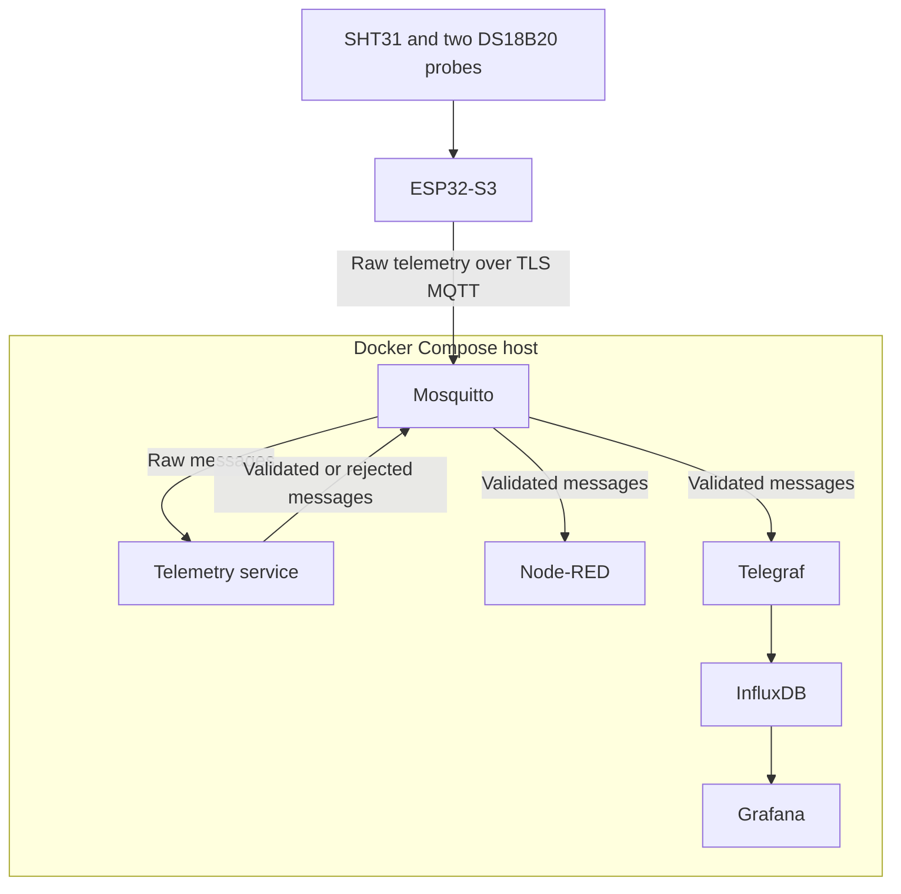

# System Architecture

## Overview

MicroHydros collects temperature and humidity readings from an ESP32-S3 sensor node. The device publishes raw readings over Wi-Fi and TLS MQTT. Services running in Docker containers validate the readings, store accepted measurements and display them in a dashboard.

The prototype has been tested with one SHT31 and two waterproof DS18B20 probes. It publishes one combined message per cycle, every five seconds by default. A tested cycle produced four validated measurements and no rejections (`validated=4 rejected=0`). The interval is configurable in the firmware.

Exact topic names, payload fields, units and rejection reasons are defined in the [data contract](data-contract.md). The [hardware selection](hardware-selection.md) document describes the tested sensors and wiring.

## Components

| Component | Role |
| --------- | ---- |
| SHT31 | Measure internal air temperature and relative humidity |
| External DS18B20 | Measure external temperature |
| Water DS18B20 | Measure water or nutrient-solution temperature |
| ESP32-S3 | Read sensors and publish raw telemetry over Wi-Fi and TLS MQTT |
| Mosquitto | Authenticate MQTT clients and enforce topic permissions |
| Python telemetry service | Validate and timestamp readings; publish validated or rejected results |
| Node-RED | Inspect validated MQTT messages |
| Telegraf | Write validated MQTT measurements to InfluxDB |
| InfluxDB | Store historical measurements |
| Grafana | Display telemetry from InfluxDB |

## Deployment

Mosquitto, the telemetry service, Node-RED, Telegraf, InfluxDB and Grafana run as Docker Compose services on a host computer. The ESP32-S3 connects to the broker through the local network. The firmware can be built and flashed from the same computer or another computer with ESP-IDF installed.

The device uses a stable mDNS name such as `<broker-hostname>.local` to reach the broker on port `8883`. The broker certificate must include the name the device uses.
Containers connect to Mosquitto using the Compose service name `mosquitto`. `localhost` refers to the computer or container where a client runs, so it is not a broker address for the ESP32-S3.

The Raspberry Pi Zero 2W is an optional future host. The full six-service stack has not been adopted on it because of limited resource margin.

## Telemetry flow

1. The ESP32-S3 reads the SHT31 and both DS18B20 probes. The two DS18B20 roles are assigned by their configured ROM addresses, independent of discovery order.
2. It records the readings, sensor statuses, device ID, boot ID, sequence number and uptime in one JSON message.
3. It publishes the raw message to Mosquitto with MQTT QoS 1. Telemetry messages are not retained.
4. The Python telemetry service checks the message metadata and validates each measurement independently. It assigns UTC timestamps.
5. Valid readings are published to separate validated MQTT topics. Failed readings or invalid messages are published to a rejected topic.
6. Node-RED displays validated messages. Telegraf consumes those messages and writes the measurements to InfluxDB. Grafana reads the stored data from InfluxDB.

A failed sensor does not block valid readings from the same message. Rejected readings are excluded from the normal InfluxDB measurement series.

## Validation and delivery

The firmware reports sensor detection and read failures in its payload. The Python service checks the JSON structure, schema version, device identity, required metadata, sensor status, numeric types and plausible value ranges. The data contract contains the detailed validation rules.

MQTT QoS 1 can redeliver a message. The telemetry service uses the device ID, boot ID and sequence number to recognize recently processed cycles. This recent-message record is held in memory and resets when the service restarts.

The backend logs raw-message receipt, validated and rejected counts, and the topics queued for publication. The live sensor test showed all four measurements accepted and the validated temperature and humidity topics reaching their subscribers.

## Storage and interfaces

Docker volumes preserve Mosquitto, Node-RED, InfluxDB and Grafana data across container restarts.
Grafana's data source and MicroHydros dashboard are also provisioned from files in the repository.

| Interface | Host port | Purpose |
| --------- | --------- | ------- |
| MQTT over TLS | `8883` | Device and authenticated MQTT clients |
| Node-RED | `1880` | Flow editor and message inspection |
| InfluxDB | `8086` | Data access and administration |
| Grafana | `3000` | Dashboard |

## Security

Mosquitto uses TLS, username/password authentication and topic ACLs. Its plaintext port `1883` is disabled.
Client credentials, private keys and local configuration files containing secrets are excluded from Git.

The web interfaces currently use HTTP. Access control and HTTPS for these interfaces, along with restricted InfluxDB tokens for individual services, are the remaining security improvements.
The development services should be used on a trusted local network.
