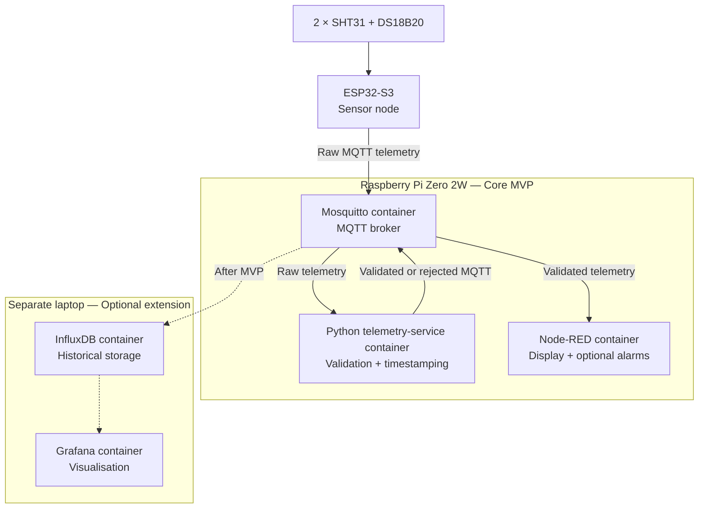

# System Architecture

## Status

Draft — subject to team review and approval.

## Architecture overview

MicroHydros uses an ESP32-S3 sensor node to collect environmental measurements. The device performs basic sensor-read validation and publishes raw measurements over Wi-Fi using MQTT.

Mosquitto, the Python telemetry service and Node-RED run as separate Docker containers on a Raspberry Pi Zero 2W. Mosquitto routes MQTT messages, while the Python service validates, timestamps and separates the measurements. Node-RED displays validated data and may later handle alarms.

InfluxDB and Grafana are optional extensions outside the MVP. They may later run as containers on a separate laptop without requiring changes to the sensor firmware.

## Component responsibilities

| Component | Responsibility | MVP |
| --------- | -------------- | --- |
| Internal SHT31 | Measure internal air temperature and relative humidity | Yes |
| External SHT31 | Measure external air temperature | Yes |
| DS18B20 | Measure water or nutrient-solution temperature | Yes |
| ESP32-S3 | Read sensors, perform initial checks and publish raw MQTT telemetry | Yes |
| Mosquitto | Route MQTT messages between publishers and subscribers | Yes |
| Python telemetry service | Validate, timestamp and separate individual measurements | Yes |
| Node-RED | Display validated measurements and support optional alarm flows | Yes |
| InfluxDB | Store validated historical measurements | No |
| Grafana | Display historical measurements and trends | No |
| Telegram | Deliver external alarm notifications | No |

## Deployment architecture

The ESP32-S3 and Raspberry Pi Zero 2W communicate through the same local network. The Raspberry Pi hosts the three core services using Docker Compose.

Optional historical-storage and visualisation services run on a separate laptop to avoid overloading the Raspberry Pi Zero 2W.



## Docker deployment

The core services are managed using Docker Compose.

- Mosquitto, the Python telemetry service and Node-RED run as separate containers.
- Containers restart automatically after failure or host restart.
- Persistent volumes preserve Mosquitto and Node-RED data.
- Docker Compose files, Mosquitto configuration, Python source code and reviewed Node-RED flow exports may be version controlled.
- Passwords, tokens, `.env` files and credential secrets must not be committed.

The Python telemetry service is designed to be stateless. It receives raw MQTT messages and immediately publishes validated or rejected results.

## Measurement data flow

1. The ESP32-S3 reads all three sensors every 30 seconds.
2. It performs initial checks for sensor communication or conversion failures.
3. It creates one raw JSON payload containing measurements, sensor statuses, device ID, boot ID, sequence number and uptime.
4. It publishes the payload to the device's raw MQTT topic using QoS 1.
5. The Python telemetry service subscribes to raw telemetry.
6. It validates common metadata and validates each measurement independently.
7. It assigns one UTC timestamp to the measurement cycle.
8. Each valid measurement is published to its individual validated topic.
9. Message-level and measurement-level failures are published to the rejected topic.
10. Node-RED and future services consume validated measurements without requiring changes to the ESP32 firmware.

## MQTT topics

```text
microhydros/v1/devices/esp32s3-01/telemetry/raw
microhydros/v1/devices/esp32s3-01/telemetry/validated/{measurement}
microhydros/v1/devices/esp32s3-01/telemetry/rejected
microhydros/v1/devices/esp32s3-01/status
```

The Python telemetry service subscribes to raw measurements from every compatible device using:

```text
microhydros/v1/devices/+/telemetry/raw
```

Node-RED and future storage services subscribe to validated measurements using:

```text
microhydros/v1/devices/+/telemetry/validated/+
```

Node-RED subscribes to device availability using:

```text
microhydros/v1/devices/+/status
```

## Delivery behaviour

| Property | Decision |
| -------- | -------- |
| Measurement interval | 30 seconds |
| MQTT QoS | 1 |
| Retained telemetry | No |
| Retained device status | Yes |
| Timestamp authority | Python telemetry service |
| Timestamp format | UTC using ISO 8601 |
| Offline buffering | Outside the MVP |

QoS 1 can deliver a message more than once. Consumers can use `device_id`, `boot_id` and `sequence` together to identify one measurement cycle.

A valid timestamp looks like:

```text
2026-09-08T10:15:30Z
```

## Validation and failure handling

Validation is performed at two levels.

### ESP32-S3 validation

The ESP32-S3 checks whether each sensor was read successfully before publishing.

If a sensor fails:

- Its measurement value is set to `null`.
- Its sensor status is set to an error value such as `read_error`.
- `NaN`, infinity or invented replacement values must not be published.
- The failed measurement may reach the raw topic for diagnostics, but it cannot become validated telemetry.

### Python telemetry-service validation

The Python service rejects the complete raw message if its common metadata cannot be trusted.

Examples include:

- An empty payload or invalid JSON
- An unsupported schema version
- A missing or invalid device ID
- A device ID that does not match the MQTT topic
- A missing or invalid boot ID, sequence number or uptime

The Python service validates sensor measurements independently.

A measurement is rejected if:

- Its required field is missing.
- Its value is `null`.
- Its value is not a finite number.
- Its corresponding sensor status is not `ok`.
- Its value is outside the configured plausible sensor range.

A failed measurement does not prevent other valid measurements from being published.

Rejected data must not be forwarded to normal InfluxDB measurement series, Grafana or other consumers of validated telemetry.

### Validation versus alarms

Validation determines whether data is trustworthy enough to process.

An alarm determines whether a valid measurement is outside the desired growing conditions.

A measurement must not be rejected only because it is outside the preferred growing range. Alarm limits are configured separately from technical plausibility limits.

## Device availability

The ESP32-S3 publishes its availability to:

```text
microhydros/v1/devices/esp32s3-01/status
```

Online status and MQTT Last Will and Testament messages are retained.

Example online status:

```json
{
  "schema_version": 1,
  "device_id": "esp32s3-01",
  "boot_id": "a3f82c10",
  "status": "online"
}
```

If the ESP32-S3 disconnects unexpectedly, Mosquitto publishes:

```json
{
  "schema_version": 1,
  "device_id": "esp32s3-01",
  "boot_id": "a3f82c10",
  "status": "offline"
}
```

Node-RED records when it receives status messages. This allows the system to distinguish between stable measurements and a device that has stopped communicating.
